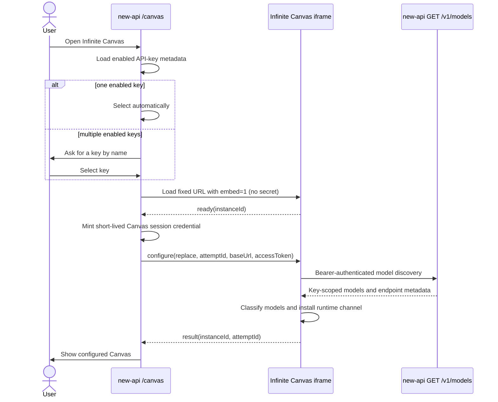

# Embedded Infinite Canvas Automatic Configuration Design

## Summary

Replace the authenticated sidebar's external **Infinite Canvas** link with an
embedded route. The route selects one of the current user's enabled API keys,
exchanges that selection for a short-lived Canvas session credential, passes the
session credential to the trusted Canvas iframe through a cross-origin
`postMessage` handshake, and lets Canvas discover and classify the models
available to the selected key. The reusable source API key never leaves
new-api.

Automatic configuration is an embed-only runtime overlay. It must not persist
the injected Base URL, session credential, channels, or model defaults, and it
must not replace the configuration used when Canvas is opened directly. Canvas
projects, assets, generated media, and the user's existing manual configuration
continue to use their current browser storage and remain available in both access
modes on a verified same-site deployment.

This design spans the current `new-api` repository and the sibling
`../infinite-canvas-source` repository.

## Goals

- Open Infinite Canvas inside the authenticated new-api layout.
- Use the current site's API address without asking the user to copy it.
- Automatically use the only enabled API key or ask the user to choose by name
  when more than one enabled key exists.
- Discover the exact model set available to the selected key through
  `GET /v1/models`.
- Configure image, video, text, and audio model choices when supported by
  capability-specific metadata or the documented safe fallbacks, with video
  generation ready immediately when a video model is recognized.
- Keep short-lived Canvas credentials and inferred model configuration in memory
  only.
- Preserve directly opened Canvas as a manually configured experience.
- Preserve all Canvas projects, assets, generated media, and existing manual
  configuration across embedded and direct access on supported, verified
  same-site deployments.

## Non-goals

- Do not create API keys automatically.
- Do not add database tables or change billing calculations.
- Do not persist embed-provided credentials in Canvas storage.
- Do not redesign Canvas's existing manual channel editor.
- Do not create a second, Canvas-specific model discovery endpoint.
- Do not proxy all Canvas generation traffic through the parent window.
- Do not synchronize browser-local Canvas data between devices.

## Current State and Constraints

- `web/src/hooks/use-sidebar-data.ts` currently exposes Infinite Canvas as an
  external link to `https://canvas.xjy.de5.net/`.
- Authenticated chat routes already demonstrate full-page iframe rendering and
  retrieval of a user's full API key, but they place reusable credentials in
  resolved URLs. This design must not repeat either the transport or the
  long-lived credential delegation.
- Canvas currently accepts `baseUrl` and `apiKey` query parameters for any
  top-level visit and persists them in the normal configuration store. It does
  not distinguish embedded access from direct access and does not fetch models
  after importing those parameters.
- Canvas stores projects and media through browser storage scoped to the Canvas
  origin. Modern browsers may additionally partition third-party iframe storage
  by top-level site, so direct/embedded data continuity requires a same-site
  deployment and explicit cross-browser verification.
- `GET /v1/models` is protected by bearer-token authentication and returns a
  key-scoped model list. Each model may contain the existing globally aggregated
  `supported_endpoint_types`, whose scope is too broad for authorization-aware
  Canvas routing.
- The existing endpoint inference marks only some video channel types as
  `openai-video`. Explicit task billing mode is a useful site-level video hint,
  but its global model-name scope cannot prove that a selected key's channel can
  route the video endpoint.
- The deployed Canvas response must permit only itself and the exact trusted
  new-api parent origins in CSP `frame-ancestors`; the new-api SPA's existing CSP
  must add the configured Canvas origin without dropping other trusted iframe
  sources.

## User Experience

The sidebar entry remains adjacent to Playground and keeps the existing
Playground visibility gate, but it navigates to an authenticated internal
`/canvas` route.

On that route:

1. While enabled keys are loading, show a localized preparation state.
2. If there are no enabled keys, show an explanation and a link to the API Keys
   page.
3. If there is one enabled key, select it automatically.
4. If there are multiple enabled keys, show their names and ask the user to
   choose one. Never display the full key.
5. Load the credential-free trusted Canvas iframe; after its ready handshake,
   exchange the selected key ID for a short-lived Canvas session credential and
   configure it. The full source key is never returned.
6. On success, give Canvas the full available area and expose a low-interference
   **Switch API key** action.
7. Keep the selected key ID only in component state. A refresh may ask again
   when more than one key is available; neither the source key nor session
   credential is persisted.

If models are discovered but no video model is available, Canvas remains usable
for other supported capabilities and shows a clear warning that the selected key
does not provide a video model.

## End-to-End Data Flow



## new-api Frontend Design

### Route and navigation

- Add an authenticated `/canvas` route.
- Change the Infinite Canvas sidebar item from `external: true` to the internal
  route.
- Preserve its current placement and `configUrls: ['/playground']` visibility
  behavior.
- Ensure the command menu uses the same filtered internal navigation item.
- Read the fixed Canvas URL and global embed-enabled flag from server-owned
  deployment configuration exposed with the normal public system status. The
  existing authenticated bootstrap/user-status response exposes only the
  resulting per-user eligibility boolean; it never exposes the canary allowlist.
  Do not accept a Canvas URL or API Base URL override from route query parameters
  or browser storage.
- Use the origin that served the new-api page as the API Base URL sent to Canvas.
  Production Canvas URLs must be HTTPS; an HTTP exception is limited to explicit
  localhost development origins.
- Guard the route itself as well as its navigation entry. Effective eligibility
  is the server-side enabled flag plus an optional server-side allowlist of user
  IDs for canary rollout. While a user is ineligible, the menu keeps the
  configured external Canvas link and a directly entered `/canvas` route does
  not initialize or mint an embed session.

### Key selection

- Reuse the existing key-list API, but introduce a Canvas-specific query/helper
  rather than changing chat's "first enabled key" behavior. This flow never
  calls the full-key API.
- Load every page of enabled key metadata without retrieving every raw key; do
  not inherit the chat helper's current first-50-items limit.
- The selector identifies keys by user-visible name and never renders their
  secret value. Because names are not unique, duplicate names also show a safe
  disambiguator such as token ID and group/expiry metadata already returned by
  the list API; they never show a secret-derived suffix.
- Request a Canvas session credential only after selection and a valid child
  ready message. Do not call the existing full-key endpoint for this flow.
- Keep the session credential out of shared or persistent query caches.
- Do not silently select the first item when multiple enabled keys exist.

### Short-lived Canvas session credential

Add an authenticated Canvas-session endpoint that accepts a selected API-key ID
owned by the current user. It validates the source key's ownership, enabled
state, expiry, group, model limits, and user status, then returns a signed,
short-lived credential without returning the source key. Apply the same
dashboard-session authentication, CSRF protections, rate limiting, and sensitive
response logging rules used by existing key-secret operations.

The signed claims include a distinct token type, audience, source key ID, user
ID, logical Canvas session ID, issued-at time, expiry, and configured Canvas
origin. No new table or persistent token row is required. Relay authentication
checks the request `Origin` against the configured Canvas origin, loads the
source key on every request, and reapplies its current revocation, group, model,
IP, quota, and user checks. Billing and logs remain attributed to the source key.

Canvas-session authentication accepts exactly these normalized method/path
templates for the automatically configured OpenAI-compatible runtime channel:

| Method | Path | Canvas use |
| --- | --- | --- |
| `GET` | `/v1/models` | Model discovery |
| `POST` | `/v1/responses` | Text/prompt generation |
| `POST` | `/v1/images/generations` | Text-to-image |
| `POST` | `/v1/images/edits` | Image-guided generation |
| `POST` | `/v1/audio/speech` | Speech/audio generation |
| `POST` | `/v1/videos` | Video task creation |
| `GET` | `/v1/videos/:task_id` | Video task polling |
| `GET` | `/v1/videos/:task_id/content` | Completed video content |

The match is deny-by-default and occurs before the normal API-key fallback. A
Canvas credential presented to any other route or method is rejected, including
adjacent model-detail/wildcard routes; chat/completions/messages; compact
responses; embeddings/rerank/moderation/realtime/search; audio transcription or
translation; image variations; files/fine-tunes; `/v1beta` Gemini routes;
`/v1/video/generations`; video remix; Kling/Jimeng/Midjourney/Suno routes;
dashboard `/api/**`; and arbitrary model-plugin URLs. CORS `OPTIONS` requests
remain credential-free preflights and do not expand this authorization set.
Adding a future Canvas network feature requires an explicit allowlist and test
update; a broad `/v1/*` route class is forbidden.

Most listed routes currently use `TokenAuth`; video content uses
`TokenOrUserAuth`. Integrate Canvas-session recognition into both middleware
paths only for the exact entries above, then continue through the existing
distribution, quota, billing, and logging pipeline. Populate the same source-key
user context expected by video-content ownership checks; possession of a valid
Canvas credential must not make another user's task content retrievable.

The same server-side feature gate protects session issuance and every request
authenticated by a Canvas session credential. Disabling the gate or removing a
user from the canary allowlist immediately rejects both new issuance and
outstanding Canvas credentials; ordinary API keys and direct Canvas access are
unaffected.

Each issued credential has a server-enforced maximum lifetime of five minutes;
the client cannot request or configure a longer TTL. The parent begins renewal
when no more than 60 seconds remain and only while its authenticated route is
open. Renewal atomically replaces the runtime credential; it never persists it.
Disabling or deleting the source key invalidates subsequently authenticated
Canvas requests even before the signed credential expires.

### Iframe and parent handshake

- Load the configured Canvas origin with only the non-sensitive `embed=1`
  marker.
- Install the parent message listener before creating or assigning `src` to the
  iframe.
- Set an origin-only referrer policy so Canvas can derive the exact parent origin
  without exposing a parent path or query string.
- Accept messages only when both conditions hold:
  - `event.origin` equals the configured Canvas origin.
  - `event.source` equals the rendered iframe's `contentWindow`.
- Send configuration only to the exact Canvas origin, never `"*"`.
- Do not send the credential until the child emits the versioned ready message.
- The child acquires the persistent-store writer lease before emitting ready. If
  another context owns it, the child emits the credential-free blocked message
  instead; the parent shows the conflict state and must not mint a credential.
- The child retransmits the same ready message at a bounded interval until it
  receives a valid configure message or its handshake deadline expires. Duplicate
  ready messages are idempotent. Retry destroys the old iframe and creates a new
  instance rather than waiting for a one-shot message from the old document.
- Every iframe instance creates a random `instanceId`; every configure or renew
  attempt creates a random `attemptId`. Parent and child include both values in
  subsequent messages and ignore stale or mismatched results.
- A new attempt aborts the child's previous discovery request. Only the current
  attempt may atomically install runtime configuration.

The protocol uses versioned, namespaced messages:

```ts
type CanvasEmbedReady = {
  type: 'infinite-canvas.embed.ready'
  version: 1
  instanceId: string
}

type CanvasEmbedBlocked = {
  type: 'infinite-canvas.embed.blocked'
  version: 1
  instanceId: string
  code: 'writer-locked'
}

type CanvasEmbedConfigure = {
  type: 'infinite-canvas.embed.configure'
  version: 1
  instanceId: string
  attemptId: string
  payload: {
    mode: 'replace' | 'renew'
    sessionId: string
    baseUrl: string
    accessToken: string
    expiresAt: string
  }
}

type CanvasEmbedCredentialNeeded = {
  type: 'infinite-canvas.embed.credential-needed'
  version: 1
  instanceId: string
  attemptId: string
  sessionId: string
  reason: 'expiring' | 'expired'
}

type CanvasEmbedResult = {
  type: 'infinite-canvas.embed.result'
  version: 1
  instanceId: string
  attemptId: string
  payload:
    | {
        ok: true
        modelCounts: {
          image: number
          video: number
          text: number
          audio: number
        }
      }
    | {
        ok: false
        code: string
      }
}
```

Initial configuration and key replacement use `mode: 'replace'`; renewal uses
`mode: 'renew'` with the same logical `sessionId` and a new `attemptId`. A renew
message may update only the live credential provider. A credential-needed
message is accepted only for the current window, origin, instance, attempt, and
logical session, and concurrent requests collapse into one parent renewal.
A blocked message is valid only from the current iframe window and exact Canvas
origin. It contains no credential or arbitrary text. Retry creates a new iframe
instance after the user closes the competing Canvas context.

The parent should show preparation or error UI until a successful result arrives.
It may expose **Retry** and **Switch API key** after an error, but it must not
fall back to an old or manual Canvas credential. A bounded handshake timeout
turns a missing ready/result message into the same recoverable error state. The
parent maps stable child error codes to localized new-api messages instead of
accepting or displaying arbitrary child-provided error text.

Switching keys is a destructive runtime transition: first disable interaction,
remove the iframe from the DOM, and drop the parent-held session credential;
only after the old child document is gone may the parent create a fresh iframe
instance. It mints the replacement credential only after that instance sends a
valid ready message. If minting fails, the old iframe and credential remain gone
and the new iframe stays blocked behind the parent error state. Retry follows the
same destroy-before-remint sequence. This avoids needing a cross-origin clear
message or trusting an acknowledgement from a failing child.

## new-api Model Metadata Design

Continue using the existing key-scoped `GET /v1/models` contract rather than
adding a dedicated embed endpoint. Preserve the behavior of
`supported_endpoint_types` for existing clients and add an optional
`available_endpoint_types` field for authorization-aware routing plus an
optional `declared_endpoint_types` subset that preserves explicit
channel/model declaration provenance.

`available_endpoint_types` must be computed for the selected token's effective
groups and currently eligible abilities, not copied from the global union for a
model name. This prevents the same model name in another group or channel from
advertising a capability the selected key cannot route.

During key-scoped endpoint metadata construction:

1. Infer channel endpoint types only from enabled abilities in the selected
   token's effective groups and model-limit intersection.
2. For each eligible ability, use its channel-scoped advanced endpoint
   configuration for that model when present; otherwise use the existing channel
   type/model inference. Add explicitly configured values to both
   `available_endpoint_types` and `declared_endpoint_types`; inferred values go
   only to `available_endpoint_types`.
3. De-duplicate endpoint types without removing their existing priority order.
4. Return an optional `task_billing_mode` value for an accessible model when its
   global model pricing explicitly defines `per_call` or `per_second`, but keep
   it separate from endpoint capabilities.
5. Never append `openai-video` from model price or task billing mode alone. A
   global billing label cannot prove that a particular key-reachable channel can
   serve the video endpoint.

`task_billing_mode` lets Canvas corroborate a strong video-name fallback and show
the site's "per request" or "per second" label. It does not make an otherwise
ambiguous model callable as video. Administrators who need an opaque model name
recognized as video must declare `openai-video` on the eligible channel/model
configuration.

Do not merge the existing global model-name endpoint metadata into
`available_endpoint_types`. That schema has no channel or group owner, so it
cannot prove which selected-key ability can serve the endpoint. It remains in
`supported_endpoint_types` for pricing/admin and API compatibility, while Canvas
uses only endpoint evidence attached to an eligible ability. Treating global
metadata as routable later would require either an explicit invariant that it
applies to every ability with that model name or a migration to channel-scoped
declarations.

Build the response from the existing ability/channel configuration caches in one
pass rather than issuing a database query per model. This is a schema- and
behavior-compatible response extension: existing `supported_endpoint_types`
values remain unchanged, while `available_endpoint_types`,
`declared_endpoint_types`, and `task_billing_mode` are optional. Existing clients
that ignore the new fields are unaffected.

## Canvas Runtime Configuration Design

### Embed activation

Canvas enables the integration only when all of the following are true:

- `embed=1` is present.
- `window.self !== window.top`.
- A usable parent origin can be derived from the iframe referrer.
- The derived origin appears in Canvas's deployment-configured trusted-parent
  allowlist.

Only then does Canvas register the embed message listener and attempt the writer
lease. It emits ready only after acquiring the lease, or emits the credential-free
blocked state if another context owns it. It accepts configuration only from
`window.parent` and the exact derived origin. An empty, opaque, malformed, or
unlisted referrer origin fails closed. Invalid sources, origins, versions,
payloads, or URL schemes are ignored.

The trusted-parent allowlist is explicit deployment configuration, not a suffix
or wildcard match. new-api separately has one configured Canvas origin and
accepts child messages only from it. Each production, staging, and local pair
must list its exact counterpart origins.

The Canvas HTTP response also sets
`Content-Security-Policy: frame-ancestors 'self' <exact trusted parent origins>`.
This server/CDN header is the clickjacking boundary; the JavaScript allowlist is
not a substitute because untrusted parents can still render UI before the
handshake. Do not use wildcard ancestors, and do not emit a conflicting
`X-Frame-Options` header.

new-api is a client-routed SPA, so its document-level `frame-src` policy must be
route-independent. Compose the configured Canvas origin into the existing list
of trusted chat/home/about iframe sources instead of replacing that list or
trying to change CSP during client-side navigation. If deployment configuration
allows additional iframe origins, the same CSP builder must validate and include
them. Browser tests cover navigation into and out of `/canvas` without breaking
those existing embeds.

Direct visits do not register the embed configuration listener. The existing
top-level `baseUrl`/`apiKey` query import is removed so automatic credential
configuration is exclusive to embedded access.

This removal is an intentional compatibility and security break. A direct visit
containing those legacy parameters removes them from the address bar without
importing or persisting them, then shows a localized notice directing the user to
the manual channel editor. Existing manually persisted configuration is not
cleared or migrated. The Canvas release notes announce the deprecation and advise
users to delete old secret-bearing bookmarks and rotate any key that was shared
in a URL; there is no silent legacy-import fallback.

### Runtime overlay

Add an explicit runtime configuration layer to the Canvas config store:

- The persisted manual `config` and `webdav` state remain unchanged.
- Embed-provided Base URL, session credential, channels, model lists, and default
  model choices live in a separate runtime field.
- The effective-config selector prefers the runtime layer while it is active.
- The runtime layer is excluded from Zustand `partialize` and any other storage
  adapter.
- Unmounting the embed initializer or replacing the selected key clears the old
  runtime layer before installing a new one.
- A failed reconfiguration leaves no partially installed runtime channel.
- Add a single active-configuration read path and audit generation services,
  readiness checks, model selectors, non-React `getState()` consumers, and
  request resolvers so none bypass the runtime layer by reading persisted
  `config` directly.
- Route writes to embed-scoped connection/model fields (channels, Base URL,
  session credential, API format, discovered model lists, and default models)
  to the runtime layer while embedded. Other ordinary Canvas preferences may
  continue using their existing persistence behavior. Direct access keeps the
  current write behavior unchanged.
- The automatic runtime channel always uses the standard OpenAI-compatible paths
  enumerated above and bypasses persisted custom model plugins. Manual plugin
  behavior remains available only to direct/manual channels.
- Mark the automatic channel as a new-api gateway transport. Video dispatch in
  this mode must not take Canvas's current name-based direct Seedance/Ark branch;
  `dd-`/`gd-`/`jd-`/`sd-`/`vd-seedance` and other recognized video models all use
  `POST /v1/videos` plus the matching polling/content routes. Direct/manual Ark
  channels keep their existing `/contents/generations/tasks` behavior.

Canvas projects, node metadata, assets, generated media, and history continue to
use their existing persistent stores. A generation node may remember its model
name, but a direct visit still requires an appropriate manual channel before
that model can be called again.

Embedded nodes must persist a connection-neutral model reference, never the
runtime channel ID used by Canvas's current `channelId::model` request encoding.
Store the stable model ID plus capability (or an equivalent versioned neutral
reference). At dispatch time, embedded mode resolves it against the current
runtime catalog; direct mode resolves it deterministically against the first
manually configured channel, in user-defined channel order, that advertises the
same model and capability. If none exists, preserve and display the node but ask
the user to configure a matching channel; never silently substitute another
model or channel. Existing manually created channel-qualified references remain
unchanged.

### Live credential provider

Do not copy the session credential into a request configuration snapshot. Add a
runtime-only credential provider for the active embedded channel. Every network
dispatch resolves the current credential from that provider immediately before
building its authorization header. This includes video creation, every task
status poll, result download, and image/audio/text requests.

The parent renews before `expiresAt` and sends a new configure attempt. The child
atomically updates the credential provider without replacing project state or
interrupting an active task. Long-running polling loops retain only the channel
identity and call the provider on every iteration, so they naturally cross token
renewals. If a request finds the credential expired or inside the renewal safety
window, it pauses behind one bounded renewal request to the parent. Safe polling
and download requests may retry once after renewal; a non-idempotent generation
creation request is never replayed automatically after it may have reached the
server.

Unmounting, switching keys, renewal failure, or parent-session loss invalidates
the provider, rejects waiters, stops polling, and blocks new requests. Direct
access continues to resolve the persisted manual credential through its existing
path.

### Storage continuity release gate

Browser storage belongs to the Canvas origin, but a cross-site iframe may receive
a partitioned or blocked storage area that differs from a direct top-level visit.
Therefore, embedded/direct content continuity is a release requirement, not an
assumption:

- Serve the embedded Canvas from a stable, dedicated HTTPS origin that is
  cross-origin but same-site with the new-api top-level origin (same scheme and
  registrable domain). This retains iframe origin isolation while avoiding
  cross-site storage partitioning.
- Use that exact Canvas origin for both iframe and direct links; do not alternate
  between aliases or preview domains.
- Verify create/edit/reload/direct-open behavior in the currently supported
  Chrome, Firefox, and Safari versions before enabling the feature.
- Keep embedding disabled for any deployment that cannot satisfy and verify this
  condition. A future cross-site deployment requires a separately reviewed
  Storage Access API or server-sync design; silently accepting partitioned data
  is not a fallback.

### Cross-context write coordination

Sharing the same origin is insufficient when a direct tab and iframe edit stale
copies concurrently. Canvas therefore acquires a per-origin exclusive writer
lease before enabling project, asset, history, or manual-config mutations. The
same coordination code runs in direct and embedded modes. Hold the lease for the
writable page lifetime and release it on clean shutdown; browser process loss
must allow automatic lease recovery.

When another live context owns the lease, the new context enters an explicit
read-only/conflict screen and performs no persistent writes or generation that
would mutate project state. It tells the user to close the other Canvas context
and retry. Use the browser Web Locks API where supported, with a tested
same-origin coordination fallback only if it provides equivalent single-writer
semantics. If a supported browser cannot provide reliable coordination,
embedding remains disabled there. Do not offer forced takeover without a
separately designed revision/conflict protocol.

## Model Discovery and Classification

Canvas fetches the source key's effective models from the provided Base URL using
`Authorization: Bearer <short-lived Canvas session credential>`. The fetch layer
retains the model ID, `available_endpoint_types`, and optional
`declared_endpoint_types` and `task_billing_mode`. Canvas does not use globally
aggregated `supported_endpoint_types` as a routability claim. When the new fields
are absent during a staggered rollout, it uses the documented name fallbacks
rather than trusting the broader legacy field.

Classification produces a set of runtime capabilities rather than forcing every
model into one bucket:

1. Add `video` when endpoint metadata contains `openai-video`.
2. Add `image` when endpoint metadata contains `image-generation`.
3. If non-empty metadata contains only Embedding or Rerank endpoints, omit the
   model without applying name fallback.
4. Apply strong video, image, and audio name signals when the corresponding
   specific endpoint metadata is absent. This remains necessary when the only
   metadata is a generic OpenAI-compatible endpoint.
5. Add `text` for a supported text endpoint (`openai`, `openai-response`,
   `anthropic`, or `gemini`) when that endpoint appears in
   `declared_endpoint_types`, even if media capabilities also exist. For an
   inferred generic text endpoint, add `text` only when no media capability was
   found. Generic OpenAI transport compatibility alone must not place a task-only
   video model in the text selector.
6. If metadata is absent and no media heuristic matches, use the existing Canvas
   text fallback.

An explicit task billing mode strengthens but does not replace the video name
fallback. Until new-api exposes capability-specific audio endpoint metadata,
audio placement remains name-based and best-effort. Likewise, an inferred generic
text transport listed beside a media endpoint does not prove that the same model
ID is usable for text generation, so the classifier fails closed unless the text
endpoint is explicitly declared. These limitations avoid presenting models in
selectors whose corresponding endpoint may reject them.

Name-based video fallback recognizes:

- `seedance`
- `sora`
- `veo`
- `kling`
- `wan`
- `hailuo`
- `video`
- a standalone `sd` segment separated by the start/end of the name or common
  separators such as `-`, `_`, `/`, or `.`

Explicit image indicators take precedence over the standalone `sd` fallback.
At minimum, `stable-diffusion`, `sdxl`, and `sd3` remain image models. This avoids
turning common Stable Diffusion names into video models while supporting the
site's short `sd` video aliases.

The audio fallback remains the existing explicit set: `audio`, `tts`, `speech`,
`voice`, `music`, and `sound`. Existing image-name signals remain in place. These
fallbacks are deterministic, case-insensitive, and covered by table tests; they
are not treated as server-declared endpoint support.

Canvas's discovered runtime catalog indexes a model under every supported media
capability. For example, a model advertising both `openai-video` and
`image-generation` appears in both runtime selectors. This may be represented by
a runtime-only `capabilities` array or by per-capability indexes; it must not
change the persisted manual channel schema or manual capability editing used in
direct access. An explicitly declared text endpoint is likewise retained beside
media capabilities. When conflicting name-only heuristics produce more than one
media match, retain each strong match rather than discarding endpoint
information.

Within each capability, sort by model name and choose the first item as the
runtime default. Empty capability lists stay empty rather than borrowing a model
from another capability.

## Error Handling

The parent route distinguishes these states:

- no enabled key;
- key metadata loading failed;
- Canvas session credential creation or renewal failed;
- another direct or embedded Canvas context owns the writer lease;
- iframe failed to load or never completed the handshake;
- model discovery returned an authentication, authorization, CORS, or network
  error;
- model discovery succeeded but returned no supported generation models;
- model discovery succeeded but returned no video model.

Errors must not include the source key or session credential. Retrying creates a
new attempt and repeats the handshake with a clean Canvas runtime layer.
Switching keys clears the previous runtime layer before minting or sending the
replacement session credential. Late results from an earlier attempt are
ignored. If renewal fails or the active credential expires, Canvas clears the
runtime connection and blocks new generation until a fresh credential is
installed.

If there are usable non-video models, the absence of video is a warning rather
than a fatal error. If there are no usable image, video, text, or audio models,
configuration fails and Canvas generation remains blocked.

## Security

- The reusable source API key stays server-side. Never return it from the Canvas
  session endpoint or place it in iframe state.
- Never place either credential in a URL, fragment, browser history, referrer,
  log, toast, analytics event, query cache, or persisted client state.
- Attach the Canvas credential only when the normalized request origin exactly
  equals the provided new-api Base URL and the method/path is in the client-side
  mirror of the server allowlist. External asset downloads remain
  credential-free, and embedded mode never sends the credential to a custom
  model-plugin URL.
- Never use wildcard `postMessage` targets.
- Validate message origin, source, version, type, payload shape, Base URL scheme,
  trusted-parent allowlist membership, instance ID, attempt ID, and expected
  iframe lifecycle.
- Keep the short-lived Canvas session credential only in parent and child memory
  for the lifetime of the authenticated route and iframe. Clear replaced and
  unmounted credentials promptly.
- Give the session credential a distinct type and audience, a short expiry, an
  explicit Canvas origin, and the exact method/path allowlist defined above.
  Reject missing or mismatched browser origins and never accept it as a normal
  dashboard or unrestricted API token.
- Re-read and validate the source key and user on every session-authenticated
  request. Source-key deletion, disabling, expiry, permission changes, model
  restrictions, and quota restrictions remain immediately authoritative.
- Use an iframe sandbox/permission set limited to Canvas's required scripts,
  same-origin storage, forms, downloads, and explicitly required media or
  clipboard capabilities. Do not grant unrestricted top-level navigation.
- Treat the Canvas deployment origin as trusted code because it receives a live,
  limited session credential. A compromised deployment can use that credential
  until it expires or the source key is invalidated, so the short lifetime and
  server-side scope checks are required containment rather than optional defense.
- Keep new-api's existing bearer-token validation, model limits, group checks,
  expiration checks, and quota checks as the server-side authority.

## Testing

### new-api backend

Add deterministic tests showing that:

- Canvas session issuance rejects an unowned, disabled, or expired source key;
- issued claims have the correct type, audience, origin, source-key ID, and
  a strict `exp - iat <= 5 minutes` lifetime without containing the reusable
  source key;
- session authentication accepts every enumerated method/path pair and rejects
  an expired token, wrong origin, wrong audience, wrong method on an allowed
  path, every listed adjacent route, and representative dashboard/plugin routes;
- deleting, disabling, or restricting the source key invalidates later requests
  made with an already-issued Canvas session credential;
- Canvas requests preserve source-key quota enforcement, billing attribution,
  and request logging;
- video content accepts the owning source-key user context and rejects a valid
  Canvas credential bound to a different user/task owner;
- disabling the server flag or removing a canary user immediately rejects
  issuance and an already-issued Canvas credential without affecting ordinary
  API-key authentication;
- explicit `per_call` and `per_second` task billing is returned only as
  `task_billing_mode` for a model the key can access;
- task billing or fixed model price alone never adds `openai-video`;
- existing `supported_endpoint_types` values remain unchanged;
- `openai-video` is not duplicated in `available_endpoint_types`;
- clearing task billing mode removes the billing hint after cache refresh;
- `available_endpoint_types` is limited to the source key's effective groups,
  model restrictions, and enabled abilities when identical model names exist in
  different groups or channels, including the case where only another group's
  ability declares `openai-video`;
- global model-name metadata is not copied into key-scoped routability, while an
  eligible channel-scoped advanced declaration is preserved in both
  `available_endpoint_types` and `declared_endpoint_types`.

### new-api frontend

Add focused behavior tests for:

- the sidebar and command menu navigating internally while preserving the
  Playground visibility gate;
- zero enabled keys showing the create/enable-key action;
- one enabled key being selected automatically;
- multiple enabled keys requiring explicit selection by name;
- duplicate key names displaying a safe ID/group/expiry disambiguator and
  selecting the intended key ID without exposing secret-derived text;
- every key-list page being loaded without calling the full-key endpoint;
- the source key and session credential never appearing in the iframe URL or
  rendered selector;
- configuration being sent only after a valid ready message from the expected
  iframe origin and window;
- listener-first iframe creation plus repeated ready messages completing exactly
  one logical handshake;
- a writer-locked child sending blocked before ready and causing zero session
  credential issuance;
- messages from the wrong origin or window being ignored;
- stale instance/attempt results being ignored;
- successful, no-video, renewal, failed, retry, and switch-key states;
- fake timers proving no scheduled renewal at 61 seconds remaining, exactly one
  renewal at 60 seconds, and concurrent timer/credential-needed triggers
  collapsing into that same request;
- retry and key switch destroying the old iframe before minting a replacement;
- the disabled flag and canary exclusion retaining the current external
  navigation behavior and preventing route initialization.

### Infinite Canvas

Add focused tests for:

- direct access ignoring embed configuration and retaining manual configuration;
- legacy top-level credential query parameters being removed without import,
  with the manual-configuration migration notice shown;
- valid embed activation and ready/configure/result flow;
- empty or unlisted parent origin, wrong source, malformed payload, and
  unsupported protocol version being ignored;
- new configure attempts aborting old discovery requests and late results being
  unable to replace the current runtime configuration;
- runtime configuration overriding effective configuration without entering
  persisted storage;
- session credential renewal replacing only the in-memory credential;
- every request dispatch reading the live credential provider, including a video
  create/poll/download flow that crosses at least one renewal boundary;
- safe polling retrying once after renewal while a possibly accepted
  non-idempotent create request is not replayed;
- clearing runtime configuration restoring the untouched manual configuration;
- generation requests, readiness checks, selectors, and non-React store reads
  all consuming the runtime configuration rather than the persisted manual one;
- embedded custom-model plugin hooks being bypassed and authorization headers
  never being attached to external asset/plugin origins;
- embedded Seedance and standalone-`sd` aliases using the new-api `/v1/videos`
  gateway transport rather than Canvas's direct Ark task path;
- model/channel edits made while embedded updating only runtime-scoped fields;
- embedded nodes persisting a connection-neutral model reference, resolving it
  against runtime or manual channels as appropriate, and never silently falling
  back when a matching manual channel is absent;
- model metadata classification and name fallback;
- `seedance` and standalone `sd` video aliases;
- `stable-diffusion`, `sdxl`, and `sd3` image exceptions;
- models with both video and image endpoint metadata appearing in both runtime
  selectors;
- an explicitly declared text-plus-image model appearing in both selectors,
  while an inferred generic OpenAI transport beside image remains image-only;
- Embedding/Rerank-only models being omitted;
- deterministic defaults and the no-video warning;
- failed model discovery leaving no partial runtime configuration;
- direct and embedded contexts contending for the same writer lease, with the
  loser performing no persistent write and recovering after the owner closes.

## Verification

For new-api:

- Run the affected Go tests.
- Because the `/v1/models` DTO lives in `relaykit`, run
  `cd relaykit && GOWORK=off go build ./...` and keep the module independent of
  root-only packages.
- Run the affected frontend tests.
- Run frontend type checking and lint for changed files.
- Run the production frontend build.

For Infinite Canvas:

- Run `bun run test`.
- Run `bun run typecheck`.
- Run `bun run format:check`.
- Run `bun run build`.

Perform a browser-level integration check for zero, one, and multiple keys; a
successful video-capable key; a key without video models; switching keys; direct
Canvas access after embedded editing; and rejected forged `postMessage` events.
In Chrome, Firefox, and Safari, also create and reload content while embedded,
then open the exact same Canvas origin directly and confirm the content and
manual configuration continuity described above. Open direct and embedded
contexts concurrently, verify that exactly one is writable, and confirm that the
blocked context cannot overwrite the owner's newer project. Inspect deployed
headers to confirm exact `frame-ancestors` and `frame-src` policies and verify an
untrusted framing origin is blocked before UI renders. Navigate from `/canvas`
to every existing iframe-backed route and back to confirm the global SPA
`frame-src` composition does not regress them. Use an independent reviewer for
the final implementation and verification pass.

## Rollout and Compatibility

Guard the parent route and internal sidebar navigation with a deployment feature
flag that is disabled by default. The same backend gate protects session issuance
and session-token authentication. An optional server-side user-ID allowlist is
the canary mechanism; an empty allowlist means all users only after the global
flag is deliberately enabled. When effectively disabled for a user, retain the
current external Canvas link. Deploy in this order:

1. Establish the exact same-site Canvas/new-api origin pair and trusted-parent
   allowlist for the environment, including deploy-time CSP headers.
2. Deploy Canvas support for the inert `embed=1` handshake and runtime overlay.
   Direct access remains manual and functional. Publish the legacy URL-import
   removal notice before this deployment.
3. Deploy the new-api Canvas-session authentication, key-scoped endpoint metadata
   improvement, and authenticated `/canvas` route behind the disabled flag.
4. Complete backend, frontend, and cross-browser storage-continuity verification,
   then enable the flag for an internal canary cohort.
5. Monitor authentication failures, handshake error codes, generation failures,
   and quota/log attribution before progressively enabling the feature.

If the child does not support the handshake, the parent displays a configuration
error and offers retry; it never falls back to putting a credential in the URL.
The runtime rollback is to disable the server flag, which immediately rejects
outstanding Canvas session credentials and restores the previous external
navigation without a frontend rollback. The Canvas runtime code then remains
inactive during direct visits. Embedding stays disabled in any environment that
fails the origin, CSP, writer-coordination, or storage-continuity release gate.

## Acceptance Criteria

- A user with one enabled key opens embedded Canvas without copying a Base URL,
  key, or model name.
- A user with multiple enabled keys must choose one by name before Canvas receives
  a short-lived credential.
- Duplicate key names are safely disambiguated without revealing any secret
  material, and the selected ID is the key used for billing and model limits.
- The reusable source key never leaves new-api, and invalidating it stops an
  already-issued Canvas session credential from authorizing later requests.
- A selected key's effective, group-scoped models populate each safely inferred
  Canvas media capability list, including simultaneous explicit image/video
  capability from `available_endpoint_types`, explicitly declared text/media
  combinations, and the site's Seedance and standalone-`sd` video aliases.
- Explicit `per_call`/`per_second` billing is represented as separate
  `task_billing_mode` metadata and never invents `openai-video` routability.
- The iframe URL and browser history never contain either credential.
- Closing embedded Canvas removes its runtime credential and model configuration.
- Direct Canvas access retains projects, assets, generated media, and the user's
  previous manual configuration, but does not inherit the embedded credential.
- Direct Canvas access never imports credential query parameters automatically;
  users configure or change its manual channel explicitly.
- Embedded creations remain visible when Canvas is later opened directly in the
  same supported browser profile through the exact same verified, same-site
  Canvas origin.
- Concurrent direct and embedded contexts cannot both write the same Canvas
  origin's persistent project/configuration stores.
- Video polling and result retrieval continue across session-credential renewal
  without persisting a credential or replaying a non-idempotent creation request.
- Failure states provide retry or key-switch actions without silently using stale
  credentials.
- Disabling the feature flag restores the previous external link without losing
  Canvas content or manual configuration and immediately rejects Canvas session
  issuance and authentication.
